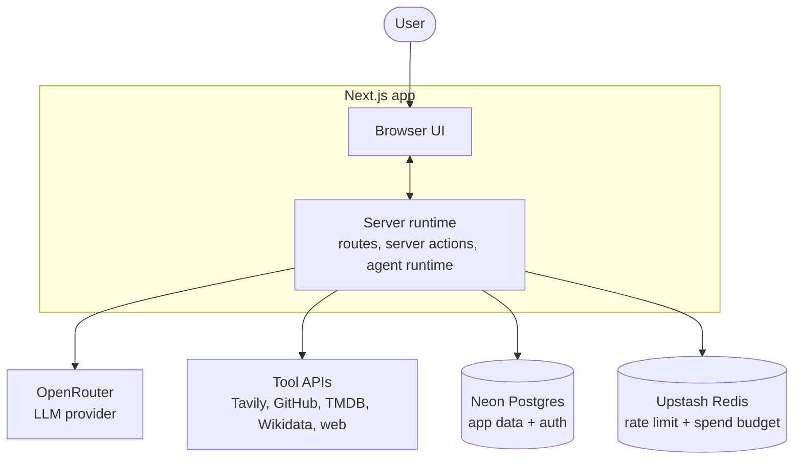
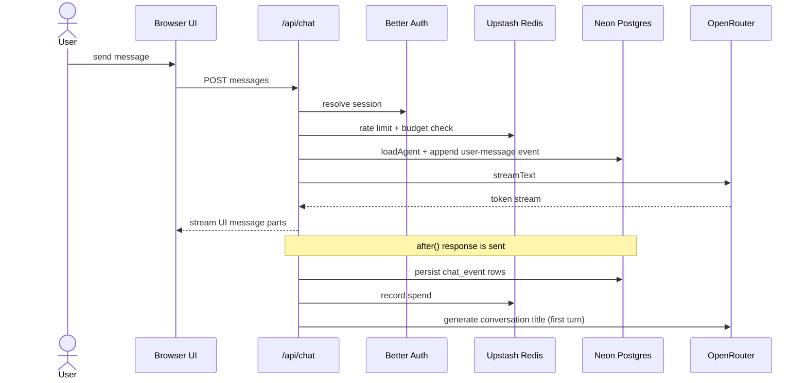
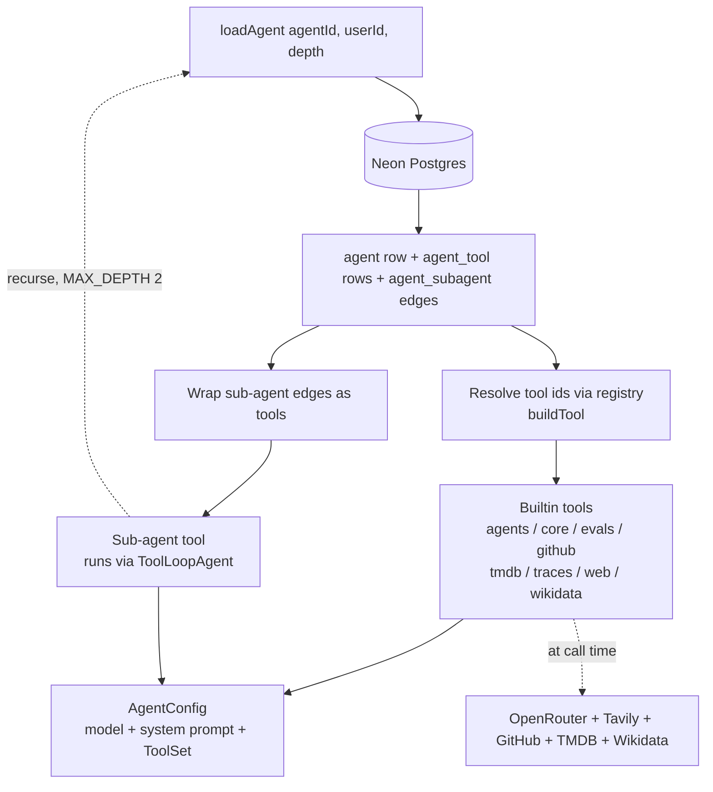
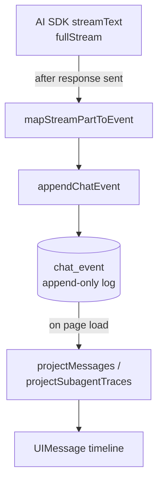
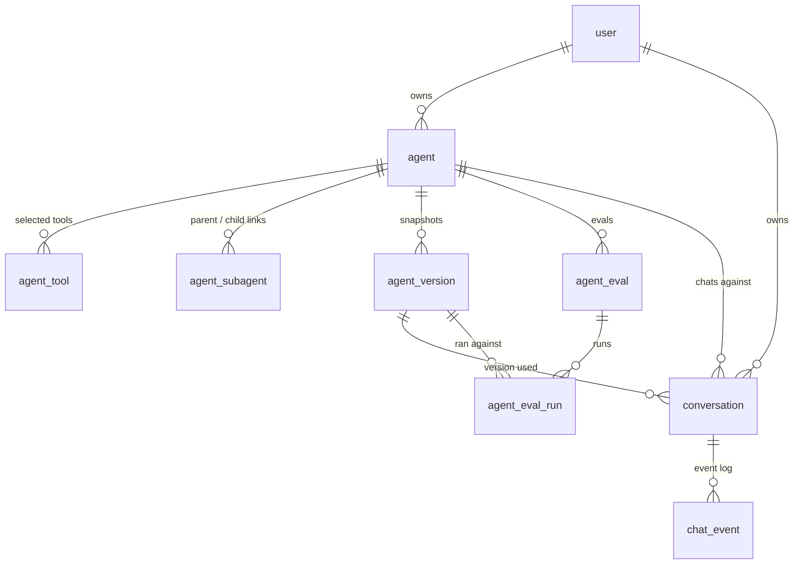

# Architecture

How the system fits together. Cross-cutting agent rules live in [AGENTS.md](AGENTS.md); visual/copy decisions in [DESIGN.md](DESIGN.md).

comal.dev is a Next.js app with event-sourced chat persistence, an Effect-based service layer over Neon, and a static builtin-only tool registry. The overview below shows the moving parts; the diagrams after it drill into each one.

## System overview

Authentication is Better Auth. Every visitor gets an anonymous session bootstrapped at the edge by `proxy.ts`, optionally upgraded to a GitHub account. All persistence, Better Auth tables included, lives in Neon Postgres.

## Chat request flow

The assistant turn is persisted only after the response is sent. Budget spend is recorded from the turn's token usage.

## Agent composition

How `loadAgent` (`src/agents/index.ts`) turns database rows into a runnable agent.

Tool ids are resolved against the static registry (`src/agents/tools/registry.ts`). Sub-agent edges become tools that recurse through `loadAgent` up to `MAX_DEPTH = 2`, so a child can have its own sub-agents (root, child, grandchild). The result is an `AgentConfig` the chat route hands to `streamText`.

## Event-sourced persistence

The stream is never stored as finished messages. Each part becomes a `chat_event` row (`src/lib/chat/persist-stream.ts`), and the projector (`src/lib/chat/projector.ts`) replays the log into a `UIMessage[]` timeline on load. Turn cost is computed at `assistant-turn-finish` from `model_pricing`.

## Data model

`chat_event` is the append-only conversation log, keyed by `(conversation_id, sequence)`. `agent_version` rows are immutable config snapshots. `model_pricing` is a standalone lookup keyed by model id. The `user` table and the rest of the auth tables (`session`, `account`, `organization`, and so on) are owned by Better Auth.

## Invariants & patterns

- **Anonymous users have the same features as signed-in users.** `src/proxy.ts` auto-provisions an anonymous session for every visitor via `auth.api.signInAnonymous`, so `session?.user` is always truthy. The only difference is that anonymous sessions don't persist across devices or browsers. To check whether a user has a real account, use `!session.user.isAnonymous` (the `isSignedIn` pattern in `src/app/(chat)/layout.tsx`). Never gate data fetching on `session?.user` alone when you mean "has an account" - anonymous users legitimately own agents, conversations, and all the same data as signed-in users.
- **Agents are user-owned, private, runtime-defined.** Each agent is a row in `agent` (`src/db/schemas/agent-schema.ts`) with selected tools in `agent_tool`. There is no sharing, no orgs, no templates. The one exception is the system agent ("Comal"), which is lazily provisioned per-user and marked with `is_system = true`.
- **Agent settings use a shell layout at `/agents/[agentId]`.** `src/app/(chat)/agents/[agentId]/layout.tsx` renders a shared header (breadcrumb with agent picker) and a sidebar nav for desktop (`AgentSettingsNav`) with a drawer fallback for mobile (`AgentSettingsMobileNav`). Sub-pages live in segment directories: `basics/`, `prompt/`, `tools/`, `sub-agents/`, `evals/`, `memory/`, `cost/`, `versions/`, and `danger/`. The index `page.tsx` is the overview. For the system agent every page renders read-only: forms receive a `readOnly` prop that disables inputs and hides save/add/remove/revert controls, the danger page replaces the delete trigger with a disabled button, and the service layer in `src/lib/agents.ts` is the source of truth (mutations return `forbidden` regardless of UI).
- **Tool registry is static and builtin-only.** `src/agents/tools/registry.ts` exposes `tools.list()` and `tools.get(id)`, and `src/agents/tools/build.ts` exposes `buildTool(id, config, context)`. Each tool lives in `src/agents/tools/<group>/<name>.ts` (the runtime builder) with a sibling `<name>.meta.ts` (id, name, description, group, config schema). To add a tool: create both files, then register the meta in `registry.ts` and the builder in `build.ts`. There is no `register()` API and no `source` discriminator; if a tool needs per-agent config, declare it in the meta's `configSchema` and read it inside the builder (see `web/fetch.ts` reading `needsApproval`). Builders that need the current user receive it via `ToolContext` (`src/agents/tools/types.ts`), which `loadAgent` constructs and passes through at build time.
- **`loadAgent(agentId, userId)`** in `src/agents/index.ts` is the single composition point: fetches the agent scoped to the owner, resolves tool ids against the registry, returns an `AgentConfig`. The chat route (`src/app/api/chat/route.ts`) calls it with `ctx.session.user.id`.
- **Sub-agents are user-defined runtime tools, not static registry entries.** An agent can designate other agents it owns as sub-agents via the `agent_subagent` join table (`src/db/schemas/agent-schema.ts`). Each row stores a `parent_agent_id`, `child_agent_id`, `alias` (the tool name exposed to the parent model), and an optional `description_override`. At runtime, `loadAgent(agentId, userId, { depth })` synthesises one `DynamicTool` per sub-agent edge and appends it to the parent's tool list. Sub-agents run via `ToolLoopAgent` with a depth-dependent `stopWhen`: the root turn caps at 8 steps (set in `src/app/api/chat/route.ts`), a depth-1 sub-agent caps at 4, and a depth-2 sub-agent caps at 2 (`subagentStepCap` in `src/agents/subagent.ts`). The depth ceiling is `MAX_DEPTH = 2`; a child loaded at depth 2 receives no sub-agent tools, so delegation tops out at three tiers (root, child, grandchild). Approval configs are stripped from all child tools at load time so sub-agents never block on human approval mid-run.
- **Cycle prevention for `updateAgent` runs inside its transaction.** `src/lib/agent-graph.ts` exposes `detectSubAgentCycle`, which assembles the owner's parent->child graph and returns any cycle path. `updateAgent` (`src/lib/agents.ts`) runs it inside its transaction, after locking every agent row the owner has, so the check sees a graph consistent with the locked write. That closes a race where two concurrent edits to different agents each passed a check against a stale graph (#140). `create-agent` still checks in the action layer: a brand-new agent has no incoming edges, so it cannot join a cross-agent cycle. Runtime depth tracking (`MAX_DEPTH`) is a second safety net. Self-links are blocked by a DB CHECK constraint and an explicit action guard.
- **Agent versions are immutable config snapshots.** The `agent_version` table (`src/db/schemas/agent-schema.ts`) stores a frozen copy of the agent's model, system prompt, tools, sub-agents, and evals at a point in time, with `created_by` attribution. Conversations reference the version used (`conversation.agent_version_id`), and eval runs are tied to the version they ran against (`agent_eval_run.agent_version_id`). The version history UI lives at `/agents/[agentId]/versions`.
- **Eval runs are traceable conversations.** `runEval(evalId, userId)` in `src/lib/eval-runner.ts` is the shared runner behind both the `run-eval` server action (`src/actions/run-eval.ts`) and the `evals-run` tool (`src/agents/tools/evals/run.ts`). It runs the agent through the streaming path (`streamText` with `stopWhen: stepCountIs(8)` and `experimental_context`, so sub-agent inner traces persist) rather than `generateText`. Each trial creates its own `conversation` row with `kind = "eval"` and writes the run into `chat_event` via `persistChatStream`; the run's `agent_eval_run.conversation_id` links the score to that trace. The `conversation.kind` column (`'chat' | 'eval'`, CHECK-constrained) keeps eval conversations out of `/chats`, `listConversationsForAgent`, and `traces-list-for-agent`. Reach an eval run's trace through its `conversation_id`, via `traces-get` or `/chats/[conversationId]/trace`. Opening an eval conversation at `/chats/[conversationId]` redirects to its trace so the scored run stays immutable. A mid-stream model failure is persisted as a `turn-error` event and still recorded as a run, so failures are inspectable in the trace.
- **The `tool-call` scorer grades tool use from the trace.** An eval with `scorer = 'tool-call'` carries a structured `assertion` (jsonb column on `agent_eval`, validated by `toolCallAssertionSchema` in `src/lib/eval-input-schema.ts`): `mustCall` / `mustNotCall` arrays of tool names (a registry id, or a `subagent_<alias>` sub-agent name) and `mustCallWithArgs` (partial argument matches). `runEval` dispatches to it after the `llm-judge` branch: `getConversationToolCalls` (`src/lib/chat/store.ts`) reads the run's `tool-input-complete` and `tool-approval-requested` events, and `scoreToolCall` (`src/lib/eval-scorer.ts`) scores the fraction of satisfied constraints, writing a per-constraint checklist into `rationale`. It is single-trial, like `llm-judge`. The `evals-create` / `evals-update` tools cannot author it (their `scorer` enum is `OUTPUT_SCORER_OPTIONS`, which excludes `tool-call`); the eval picker UI authors it through `ToolCallAssertionEditor`, whose form shape and converters live in `src/components/tool-call-assertion-form.ts`.
- **Eval runs are sandboxed.** `runEval` loads the agent with `loadAgent(agentId, userId, { sandbox: true })`. `sandboxToolSet` (`src/agents/sandbox.ts`) replaces the `execute` of every non-`read` registry tool with a stub and clears approval on all tools, so a run records its tool-call decisions in the trace without performing real writes, recursive eval runs, or external mutations. The `sandbox` flag propagates through `loadAgent` into sub-agent loads. `read` tools still execute, so multi-step chains work. `loadAgent`'s third argument is an options object, `{ depth?, sandbox? }`.
- **Sub-agent tool output shape:** preliminary yields send `{ runId, status: "running", messages: UIMessage[] }`; the terminal output, `{ runId, status: "done", text: string }`, is the last `yield`, not a `return`. The AI SDK's `executeTool` consumes a generator tool with `for await...of`, which discards the generator's `return` value and treats the final `yield` as the result. Returning the done payload instead of yielding it leaves `toModelOutput` parsing a stale `running` value and handing the parent model empty text. The sub-agent's inner stream is persisted as `chat_event` rows linked to the parent tool call via `parent_tool_call_id`. The chat route passes `experimental_context` (containing `conversationId` and `modelId`) to `streamText`, which the sub-agent tool reads at execution time. On page load, the chat page (`src/app/(chat)/chats/[conversationId]/page.tsx`) filters events to top-level (`parentToolCallId === null`) before calling `projectMessages` in `src/lib/chat/projector.ts`; `projectMessages` itself just projects whatever event set it receives. `projectSubagentTraces` consumes the unfiltered set, groups child events by `parentToolCallId`, and projects each group into `UIMessage[]`. `src/components/tool-part.tsx` detects the sub-agent shape and renders a collapsible transcript, using live stream messages during streaming and persisted traces on reload.
- **System agent ("Comal") is lazily provisioned per-user.** `src/lib/system-agent.ts` exports `getOrCreateSystemAgent(userId)`, which inserts with `onConflictDoNothing` against a partial unique index `(user_id) WHERE is_system = true`, then selects the row. Tool rows are inserted with `onConflictDoNothing` so retries are idempotent. The system agent cannot be edited or deleted (guards in both server actions and the `agents-update`/`agents-delete` tools). The home page lazy-creates it for users with no agents and redirects to a new conversation.
- **Chat routes live under `/chats`.** `/chats` lists all conversations with optional per-agent filtering (`?agent=<id>`). `/chats/new` starts a new conversation (accepts `?agent=` to preselect). `/chats/[conversationId]` is the conversation view. `/chats/[conversationId]/trace` renders the full execution timeline of a conversation from raw `chat_event` rows, including timing, tool inputs/outputs, token counts, per-step and per-run cost, and nested sub-agent steps. The home page (`/`) provisions the system agent when the user has none, otherwise links to `/chats/new` with the most recent agent.
- **Cost is computed once and read back everywhere.** `persistChatStream` prices each `assistant-turn-finish` event against `model_pricing` and stores the result in `chat_event.cost_microdollars` (integer microdollars, USD x 1,000,000). Nothing downstream recomputes; it all reads that column. `src/lib/cost.ts` holds the rollup queries: `getAgentCostRollup` (totals, per-model, and per-conversation breakdown, scoped to chat conversations with an optional `since` floor), `getAgentSpendByDay` (daily series for the chart), and `getEvalSuiteRunCosts` (total eval spend plus cost per eval suite run, grouped by `suite_run_id`). Sums include sub-agent inner turns, since those `chat_event` rows carry real cost; turn counts and the per-turn average count only top-level turns. The dashboard at `/agents/[agentId]/cost` renders these with a 30d/90d/all-time `?range=` toggle, and the `cost-summary` tool wraps `getAgentCostRollup` so Comal can answer spend questions in chat. `formatMicrodollars` (`src/lib/format-cost.ts`) is the shared microdollar-to-USD formatter, kept free of server imports so client components can use it.
- **Assistant messages have an action menu.** `src/components/chat-view.tsx` renders `MessageActionsMenu` (`src/components/message-actions.tsx`) under each completed assistant message, inside a `MessageActions` row (`src/components/ai-elements/message.tsx`). It is a dropdown whose only item so far is "save as eval", which opens `SaveAsEvalDialog` (`src/components/save-as-eval-dialog.tsx`) prefilled with the preceding user message as `input` and the assistant reply as `expected`, then appends it to the agent through `addAgentEvalAction` (`src/actions/add-agent-eval.ts`). The menu is hidden for the system agent, which cannot hold evals, and while the last message is still streaming. Add new per-message actions to this menu rather than building a second row.
- **List index pages** (`/chats`, `/agents`, `/tools`) share the same list chrome (`h1`, header row with optional primary action, `max-w-5xl`) and use shadcn `Item` / `ItemGroup` in a responsive grid (`variant="outline"` tiles). `/tools` repeats that pattern once per tool registry group section.
- **Server actions own all writes; `AgentService.update` is the single atomic write path.** `src/actions/{create,update,delete}-agent.ts` use `next-safe-action`. Per-concern update actions (`update-agent-basics.ts`, `update-agent-prompt.ts`, `update-agent-tools.ts`, `update-agent-subagents.ts`, `update-agent-evals.ts`) each accept their own slice plus `agentId` and call `AgentService.update` (`src/lib/agents.ts`) with a patch function, `(current) => next`. The update method runs the whole read-modify-write inside one transaction: it locks every `agent` row the owner has with one `SELECT ... FOR UPDATE` ordered by id, reads the current config, applies the patch, checks for a sub-agent cycle, and writes. Locking the whole owner set rather than the single target row serializes concurrent updates across all of an owner's agents, so two writes issued close together (two browser tabs, "save as eval" twice) can no longer drop each other's changes, and a cross-agent sub-agent cycle check always sees a consistent graph. The method also owns the existence, ownership, and system-agent guards, failing `AgentNotFoundError` or `ForbiddenError`, so callers pass `agentId` and `userId` without a separate `AgentService.assertOwnership` pre-check. The monolithic `update-agent.ts` action takes a full `AgentInput` and passes `() => input` as the patch. Mutations validate against `agentInputSchema` (`src/lib/agent-input-schema.ts`), which `superRefine`s tool ids against the registry.
- **`runEvalSuite` runs an agent's whole eval suite.** `runEvalSuite(agentId, userId)` in `src/lib/eval-runner.ts` runs every eval the agent owns through `EvalRunnerService.runEval`, capped at 3 concurrent by an es-toolkit `Semaphore`. The `run-eval-suite` action (`src/actions/run-eval-suite.ts`) and the `evals-run-batch` tool wrap it, and the "Run all evals" button on the evals page calls the action. One failing eval carries an `error` in its result rather than failing the batch. `runEvalSuite` mints a `suiteRunId` and threads it through `runEval` onto every `agent_eval_run` row (the `suite_run_id` column), so a suite run's cost is queryable; `run_group_id` stays separate, grouping only the trials of one multi-trial eval.
- **Eval history surfaces as a per-version trend.** `EvalService.getScoreTrend(agentId)` aggregates every `agent_eval_run` by the `agent_version` it ran against, returning one mean score per version oldest-first, with `isRegression` set when a version scores below the one before it. The evals page (`/agents/[agentId]/evals`) renders it through `EvalTrendChart` (`src/components/eval-trend-chart.tsx`), which flags regressions on the chart and in a short text summary. `EvalService.listRunHistory(agentId, { evalId?, limit?, cursor? })` is the paginated raw-run query behind the `evals-get-history` tool, so Comal can pull run history in chat; it reuses the `createdAt|id` cursor scheme from `ChatStoreService.listTracesForAgent`. `EvalService.listRunsForAgent` (latest run per eval, for the score badges) stays as its own query rather than being derived from a paginated source, since the latest run for an eval can fall on any page.
- **Cache invalidation is paired with every write, in the same code path.** Server Actions use `updateTag(tag)`. Route Handlers (including `/api/chat` and tools that mutate during a chat turn) use `revalidateTag(tag, "max")`. `updateTag` throws Next.js error E872 from a route handler, and because we wrap effects in `Effect.catchAll(...)`, that throw silently swallows the downstream write of any stream event after it. The rule: when the route handler creates, updates, or deletes a row, the matching `revalidateTag` call sits next to the write, not deferred to a later async step. Skipping the invalidation, or pushing it past a navigation boundary, lets `ConversationsProvider`'s re-seed replace fresh client state with stale server state on the next nav.
- **Business logic lives in `Effect.Service` classes with `accessors: true`.** `src/lib/agents.ts`, `chat.ts`, `chat/store.ts`, `chat/persist-stream.ts`, `cost.ts`, `evals.ts`, `eval-runner.ts`, `system-agent.ts` each export one service: `AgentService`, `ChatService`, `ChatStoreService`, `ChatPersistService`, `CostService`, `EvalService`, `EvalRunnerService`, `SystemAgentService`. Call methods via the accessor pattern: `yield* AgentService.getForUser(agentId, userId)`. Services yielding the database get `Database` from context; cross-service deps go in the service's `dependencies: [...]` array (see `EvalRunnerService`). Methods are wrapped with `Effect.fn("ServiceName.method")` for traced spans and annotated with the business ids (`agentId`, `userId`, `conversationId`) that matter.
- **Runtime composition lives in `src/db/runtime.ts`, not `src/db/service.ts`.** `Database` is a `Context.Tag` defined in `src/db/service.ts`, exported alongside `AppLive`, `runQuery`, and `runMutation`. `src/db/runtime.ts` does `Layer.mergeAll(...*.Default).pipe(Layer.provideMerge(AppLive))` and creates `appRuntime` via `ManagedRuntime.make`. Importers pull `appRuntime` from `@/db/runtime`. The split is load-bearing: re-exporting `appRuntime` from `service.ts` creates a runtime-cycle through the services, where `AgentService.Default` is `undefined` at module-eval time. Do not undo it.
- **Errors are `Schema.TaggedError` with domain-specific tags.** `src/lib/errors.ts` defines `AgentNotFoundError`, `AgentVersionNotFoundError`, `ConversationNotFoundError`, `EvalNotFoundError`, `UnknownToolError`, `ForbiddenError`, `UnauthorizedError`, `ValidationError`, `DatabaseError`, `LLMError`, `MessageConversionError`, `AgentCycleError`, `RateLimitCheckError`. There is no generic `NotFoundError`; pick the specific one. Schema errors carry a required `message` field. Action layer handlers re-throw `cause.error` directly when surfacing typed failures rather than reconstructing fresh errors.
- **Persistent user memory is user-scoped and opt-in per agent.** Memory lives in two tables (`src/db/schemas/memory-schema.ts`): `memory` (one row per fact, `embedding vector(1536)` with an HNSW + `vector_cosine_ops` index) and `user_memory_settings` (per-user cap, default 500). `agent.enable_memory` gates access: only agents with the flag set get the three memory tools (`memory-save`, `memory-search`, `memory-delete` in `src/agents/tools/memory/`) and only their turns auto-inject. Memory is user-scoped, not agent-scoped, so every memory-enabled agent reads the same pool; `memory.source_agent_id` records who saved each row for the UI badge but is not used for lookup. Embeddings reuse OpenRouter via `openrouter.textEmbeddingModel("openai/text-embedding-3-small")`; rows are inserted with `embedding = NULL` and embedded in the chat route's `after()` hook via `embedMany`, so a memory saved mid-conversation isn't searchable until the next turn. Auto-injection runs before `streamText`: embed the latest user message, cosine-similarity search top 5 above 0.75, append as a `<memory>` block to the system prompt. Sub-agents do not get memory tools, filtered at `depth > 0` in `buildToolsRecord` (`src/agents/index.ts`).
- **Persistence stays Effect-based.** The project uses `drizzle-orm/neon-serverless` (WebSocket pool), so `db.transaction()` works fine and is the correct primitive for multi-statement atomic writes. Do not replace transactions with `db.batch()`; that pattern applies only to the Neon HTTP driver, which this project does not use. For a single write, sequence inside a single `runQuery` / `runMutation` closure. For non-trivial Effect work (errors, services, layers, observability, logging), load the `effect-best-practices` skill first; the patterns there go further than this bullet.
- **Generated API clients live in `src/clients/<name>/`.** Each is produced by `bun run openapi-ts` from a spec; treat `*.gen.ts` and the barrel `index.ts` as build output and do not hand-edit. Tools import SDK functions and types from the barrel (`@/clients/<name>`) only. Auth is passed per-call via the `auth` option on each SDK function (see `src/agents/tools/tmdb/*.ts`); `client.setConfig` is avoided so tools don't mutate a shared singleton. Tools are intentionally thin pass-throughs: they call one SDK function, surface `error` as a thrown `Error`, and return raw `data` so the model gets the upstream shape it already knows.
- **Client-side stores are React Context + `useState`, split across three files.** Context (and its types) in `src/components/<name>-context.ts`, hook in `src/hooks/use-<name>.ts`, provider component in `src/components/<name>-provider.tsx`. The split is mandatory: keeping the hook and context in the same file as the provider trips `react-refresh/only-export-components`. Server components own the source of truth and pass it as the provider's `initial` prop; the provider re-seeds local state when `initial` changes by storing the previous value in state and resetting during render (do not use `useEffect` for this; it cascades renders and trips `react-hooks/set-state-in-effect`). Mutations from streaming responses (e.g. AI SDK `data-*` parts) call hook setters directly. The conversations sidebar (`src/components/conversations-provider.tsx`, `src/hooks/use-conversations.ts`) is the canonical example.
