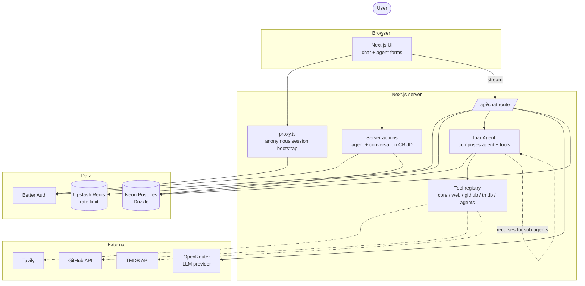

# comal.dev

Create AI agents that are yours. Pick a model, write a system prompt, attach some tools, and start chatting.

## About

A web app for building private, runtime-defined AI agents. The system prompt, model choice, and tool selection are all per-agent and stored under your account. You can start chatting anonymously and sign in with GitHub if you want to keep the history.

## Architecture

How a chat request flows through the app:

## Features

- Private agents with custom system prompts
- Any model available through OpenRouter
- Full access without an account - anonymous sessions get the same features as signed-in users, just not persistent across devices
- Streaming chat with markdown, code, math, mermaid
- Approval-gated tools that pause and ask before running
- Conversation history with per-conversation model switching
- Sub-agents: let an agent call other agents you own as tools
- Conversational agent management via Comal, a system agent that can create and configure agents through chat

## Tools

- **Current time** — Returns the current date and time in the user's timezone.
- **Web search** — Searches the web (via Tavily) and returns a list of titles, URLs, and snippets.
- **Web fetch** — Fetches the contents of a URL and returns it as markdown, text, or HTML.
- **GitHub read** — Reads files from public GitHub repositories in batch.
- **TMDB search** — Searches TMDB across movies, TV, and people in a single request.
- **TMDB trending** — Lists what's trending across movies, TV, and people on TMDB.
- **TMDB trending movies** — Lists trending movies on TMDB.
- **TMDB trending TV** — Lists trending TV series on TMDB.
- **TMDB discover movies** — Discovers movies on TMDB by genre, year, language, and sort order.
- **TMDB discover TV** — Discovers TV series on TMDB by genre, first-air year, language, and sort order.
- **TMDB movie details** — Fetches full TMDB metadata for a movie by id.
- **TMDB TV details** — Fetches full TMDB metadata for a TV series by id.
- List all agents owned by the current user.
- Get full configuration for a specific agent.
- List the tool registry with IDs, names, and descriptions.
- List available model providers and their models.
- Create a new agent with smart defaults and tool name resolution.
- Update an existing agent's configuration.
- Delete an agent owned by the current user.

Agents can also call other agents you own as sub-agent tools, configured per-agent in the agent form. New users start with Comal, a system agent that can create and configure other agents through conversation.

## Tech stack

- Next.js 16
- React 19
- TypeScript
- Tailwind CSS v4
- shadcn/ui
- Better Auth
- Drizzle ORM + Neon Postgres
- Vercel AI SDK + OpenRouter
- Upstash Redis
- next-safe-action
- TanStack Form
- Bun

## Getting started

1. `bun install`
2. Copy `.env.example` to `.env` and fill in:
   - `DATABASE_URL`
   - `BETTER_AUTH_SECRET`
   - `BETTER_AUTH_URL` (optional locally; pin only if you need a canonical URL)
   - `GITHUB_CLIENT_ID` / `GITHUB_CLIENT_SECRET`
   - `OPENROUTER_API_KEY`
   - `TAVILY_API_KEY`
   - `TMDB_READ_ACCESS_TOKEN`
   - `UPSTASH_REDIS_REST_URL` / `UPSTASH_REDIS_REST_TOKEN`
3. `bun run db:push`
4. `bun dev`
