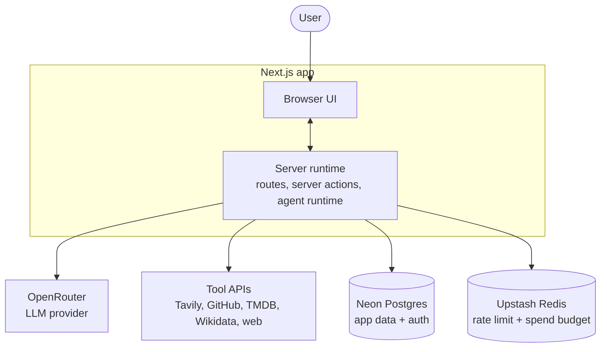
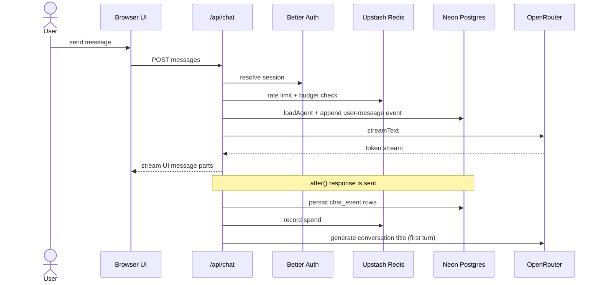
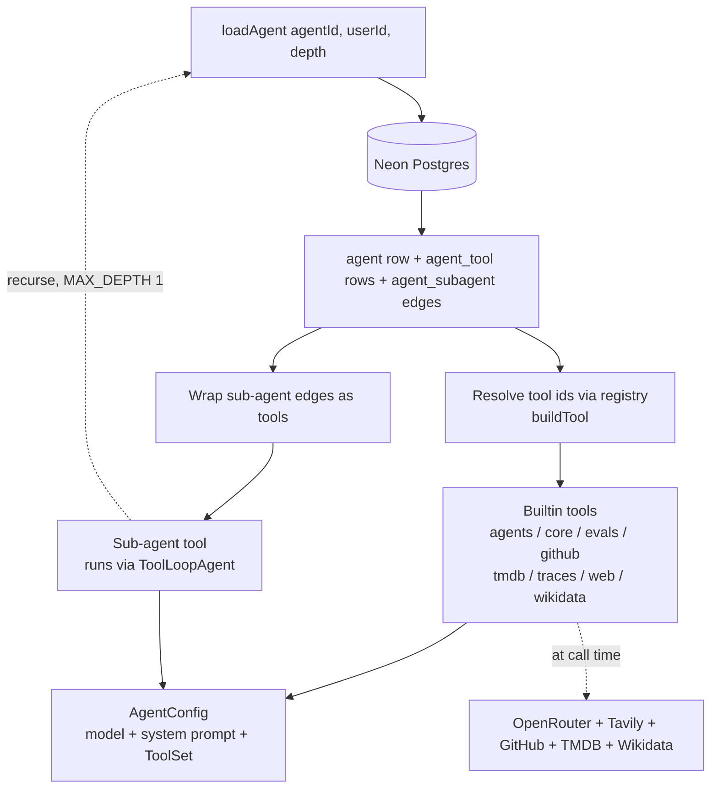
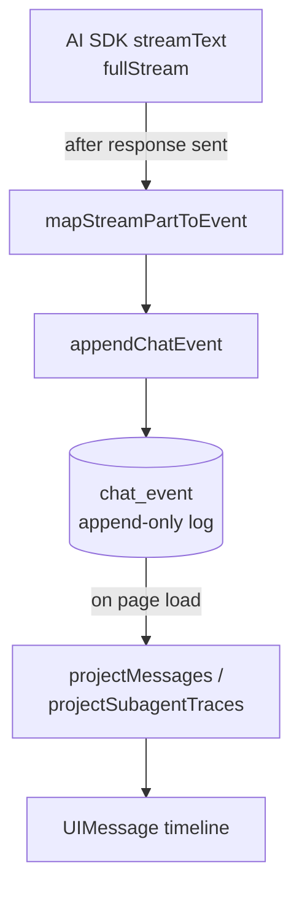
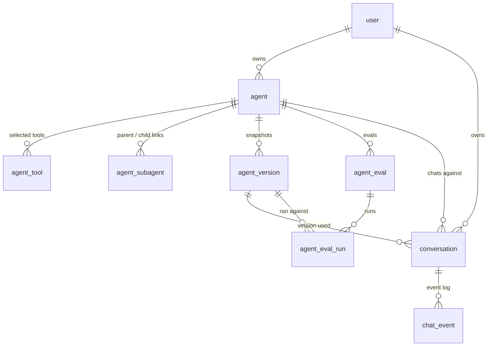

# comal.dev

Create AI agents that are yours. Pick a model, write a system prompt, attach some tools, and start chatting.

## About

A web app for building private, runtime-defined AI agents. The system prompt, model choice, and tool selection are all per-agent and stored under your account. You can start chatting anonymously and sign in with GitHub if you want to keep the history.

## Architecture

comal.dev is a Next.js app with event-sourced chat persistence, an Effect-based service layer over Neon, and a static builtin-only tool registry. The overview below shows the moving parts; the diagrams after it drill into each one.

### System overview

Authentication is Better Auth. Every visitor gets an anonymous session bootstrapped at the edge by `proxy.ts`, optionally upgraded to a GitHub account. All persistence, Better Auth tables included, lives in Neon Postgres.

### Chat request flow

The assistant turn is persisted only after the response is sent. Budget spend is recorded from the turn's token usage.

### Agent composition

How `loadAgent` (`src/agents/index.ts`) turns database rows into a runnable agent.

Tool ids are resolved against the static registry (`src/agents/tools/registry.ts`). Sub-agent edges become tools that recurse through `loadAgent` once (`MAX_DEPTH = 1`). The result is an `AgentConfig` the chat route hands to `streamText`.

### Event-sourced persistence

The stream is never stored as finished messages. Each part becomes a `chat_event` row (`src/lib/chat/persist-stream.ts`), and the projector (`src/lib/chat/projector.ts`) replays the log into a `UIMessage[]` timeline on load. Turn cost is computed at `assistant-turn-finish` from `model_pricing`.

### Data model

`chat_event` is the append-only conversation log, keyed by `(conversation_id, sequence)`. `agent_version` rows are immutable config snapshots. `model_pricing` is a standalone lookup keyed by model id. The `user` table and the rest of the auth tables (`session`, `account`, `organization`, and so on) are owned by Better Auth.

## Features

- Private agents with custom system prompts
- Curated model picker across OpenAI, Anthropic, Google, xAI, and DeepSeek (served via OpenRouter), each tagged with a relative cost label
- Full access without an account - anonymous sessions get the same features as signed-in users, just not persistent across devices
- Streaming chat with markdown, code, math, mermaid
- Approval-gated tools that pause and ask before running
- Conversation history with per-conversation model switching
- Sub-agents: let an agent call other agents you own as tools, with full inner traces persisted and viewable on reload
- Version history: every config change snapshots the agent, with a diff viewer and revert to any point
- Evals: attach input/expected pairs to an agent, pick a scorer (contains, exact, Levenshtein, or an LLM judge), and run them one at a time or as a full suite to track how well the agent performs. Save an assistant reply as a new eval directly from the chat.
- Execution traces: every conversation has a step-by-step trace view with tool inputs and outputs, timing, token usage, cost, and nested sub-agent steps
- Cost dashboard: a per-agent view of spend by model, by conversation, and over time, plus average cost per turn and cost per eval suite run, with a 30/90/all-time range toggle
- Conversations list at `/chats` with per-agent filtering
- Conversational agent management via Comal, a system agent that can create and configure agents through chat

## Tools

Built-in tools you can attach to an agent, grouped as they appear in the registry and on the `/tools` page.

### Agents

- **List agents**: lists all agents owned by the current user.
- **Get agent details**: returns an agent's full configuration, including tools and sub-agents.
- **List available tools**: returns the tool registry with IDs, names, descriptions, and groups.
- **List available models**: returns the model groups and model IDs available for agent configuration.
- **Create agent**: creates a new agent with the given configuration.
- **Update agent**: updates an existing agent's configuration.
- **Delete agent**: deletes an agent owned by the current user.
- **List agent versions**: lists configuration version snapshots, newest first.
- **Diff agent versions**: compares two version snapshots and returns a field-level diff.
- **Revert agent to version**: restores an agent to a previous version snapshot.

### Core

- **Current time**: returns the current date and time in the user's timezone.

### Cost

- **Summarize agent cost**: returns an agent's chat spend with totals, average cost per turn, a per-model breakdown, and the costliest conversations.

### Evals

- **Create eval**: adds an eval to an agent and snapshots a new version.
- **Update eval**: edits an existing eval and snapshots a new version.
- **Delete eval**: removes an eval and snapshots a new version.
- **List evals**: lists an agent's evals with their latest run summaries.
- **Run eval**: runs one eval against the agent's current configuration and records the score.
- **Run eval suite**: runs every eval for an agent in one batch (up to 3 at a time) and records each score.

### GitHub

- **GitHub read**: reads files from public GitHub repositories in batch.

### TMDB

- **TMDB search**: searches across movies, TV, and people in a single request.
- **TMDB trending**: lists what's trending across movies, TV, and people.
- **TMDB trending movies**: lists trending movies.
- **TMDB trending TV**: lists trending TV series.
- **TMDB discover movies**: discovers movies by genre, year, language, and sort order.
- **TMDB discover TV**: discovers TV series by genre, first-air year, language, and sort order.
- **TMDB movie details**: fetches full metadata for a movie by id.
- **TMDB TV details**: fetches full metadata for a TV series by id.

### Traces

- **List agent traces**: lists recent conversations for an agent with aggregated timing, event count, and cost.
- **Get conversation trace**: returns a conversation's execution trace with timed steps, tool inputs and outputs, errors, and token usage.

### Web

- **Web search**: searches the web via Tavily and returns titles, URLs, and snippets.
- **Web fetch**: fetches the contents of a URL as markdown, text, or HTML.

### Wikidata

- **Wikidata search**: searches Wikidata for entities by label and aliases, returning their Q-ids.
- **Wikidata item**: fetches a Wikidata item's labels, descriptions, statements, and sitelinks by Q-id.
- **Wikidata resolve ids**: resolves a batch of Q-ids and P-ids to labels and descriptions, so an agent can read a statements payload.

Agents can also call other agents you own as sub-agent tools, configured per-agent in the agent form. New users start with Comal, a system agent that creates, configures, and iterates on agents through conversation, including running their evals and inspecting conversation traces to improve them.

## Tech stack

- Next.js 16
- React 19
- TypeScript
- Tailwind CSS v4
- shadcn/ui
- Better Auth
- Drizzle ORM + Neon Postgres
- Vercel AI SDK + OpenRouter
- Upstash Redis
- next-safe-action
- TanStack Form
- Bun

## Getting started

1. `bun install`
2. Copy `.env.example` to `.env` and fill in:
   - `DATABASE_URL`
   - `BETTER_AUTH_SECRET`
   - `BETTER_AUTH_URL` (optional locally; pin only if you need a canonical URL)
   - `GITHUB_CLIENT_ID` / `GITHUB_CLIENT_SECRET`
   - `OPENROUTER_API_KEY`
   - `TAVILY_API_KEY`
   - `TMDB_READ_ACCESS_TOKEN`
   - `UPSTASH_REDIS_REST_URL` / `UPSTASH_REDIS_REST_TOKEN`
3. `bun run db:push`
4. `bun run scripts/seed-pricing.ts` to seed model pricing from OpenRouter (powers cost tracking and hourly usage budgets)
5. `bun dev`
